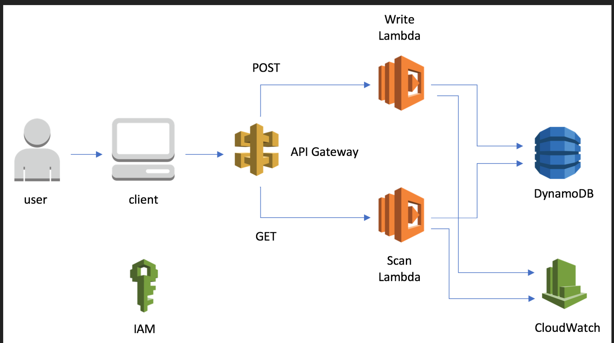

customer contact Form
Project Requirements:
Set up a free account with Amazon Web Services (AWS) (https://aws.amazon.com/). 
Using Material UI, Build a form (name, email, message, submit button). The page must be a static website, hosted in an S3 bucket. Ensure proper field level validation (E.g. Please enter a name.) and action confirmation user experiences are properly handled. 
On submit, the UI should call API Gateway to trigger a Lambda function. 
The Lambda function should send an email using SES, and store the message in DynamoDB. 

Context Diagram:

